## Overview

This guide will walk you through creating an EMDK For Android application that will use Mx features introduced in EMDK for Android API to perform device configurations. Mx represents a suite of Enterprise Features on top of standard, commercially available Android Open Source Project. So this tutorial will focus on one of the functions of App Manager API, which allows user to set any launcher application as a default launcher application using App Manager API.

The tutorial would enable user to set an application as default launcher using:

**1.  EMDK Profile Manager wizard:** 

Initially, we will configure EHS (Enterprise Home Screen) launcher application as the default launcher application using Profile Manager wizard. [Enterprise Home Screen (EHS)](https://developer.motorolasolutions.com/docs/DOC-1875) is a replacement application launcher, for Symbol Android devices, designed to allow only specified applications to be launched. So this launcher will replace the existing launcher application in the device.

**2. App Manager API:**

Once the EHS has been set as the default launcher application, we will modify this setting by setting another application as default launcher through the code using App Manager API for default launcher. You can use any applicable launcher application. We will use [Galaxy Launcher](http://www.appsapk.com/galaxy-launcher/) application to set  as default launcher application through code in this tutorial.

This allows you to understand how to configure parameters using Profile Manager and modify it using App Manager API.   
	
 
###Prerequisites

* Java Development Kit (JDK)
* Android Developer Tools (ADT) ([Android Studio](http://developer.android.com/sdk/index.html)/[Eclipse with ADT](http://developer.android.com/tools/sdk/eclipse-adt.html))
* EMDK for Android V 2.1 and above
* Download and install the required launcher applications before getting started with the tutorial. 

For more information about setting up the EMDK please see the EMDK Overview.

## Downloading required Launcher Applications:
As discussed above, we will now download and install the two launcher applications ([EHS](https://developer.motorolasolutions.com/docs/DOC-1875) and [Galaxy Launcher](http://www.appsapk.com/galaxy-launcher/)).

* You can download Enterprise Home Screen application [here](https://portal.motorolasolutions.com/Support/US-EN/Resolution?solutionId=92627&redirectForm=search&searchQuery=%3FsearchType%3Dsimple%26searchTerm%3DDownload%20EHS). Unzip the file to get the APK to install.
* You can download Galaxy Launcher application [here](http://www.appsapk.com/galaxy-launcher/).

Once downloaded, you can put them in SD card of the the device and install both of these launcher applications.

The App Manager API requires the Android *package name* of the application that you want to set as default launcher. If we know the package name then we can specify it in the field, but in this case we don't know as we have downloaded theses APK files from different sources.

   >Note:
   >Android device does not provide package names of the installed applications.

So we have [created an application](https://s3.amazonaws.com/emdk/Tutorials/AllInstalledApps-Source.zip) that finds all the installed applications programmatically and displays their package names along with the application name in a list.

You can [download](https://s3.amazonaws.com/emdk/Tutorials/AllInstalledApps.apk) the application and install it - or modify the [source](https://s3.amazonaws.com/emdk/Tutorials/AllInstalledApps-Source.zip) to your liking. Once installed, open the app and you can find the package names of both the applications.

So, the Package name for EHS Launcher App is **com.motorolasolutions.enterprisehomescreen**

   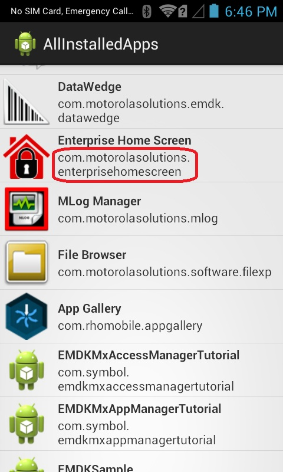 

Package name for Galaxy Launcher App is **com.epic.launcher.tw**

   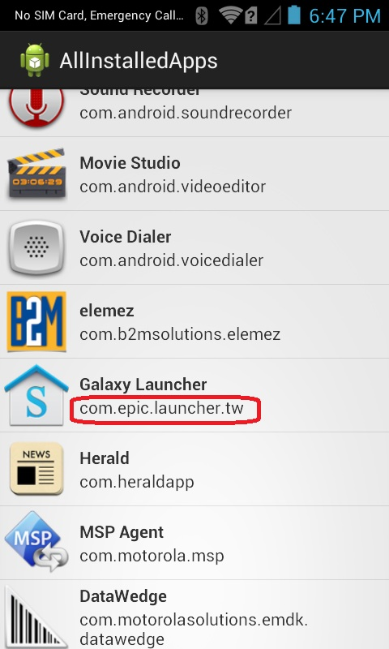 

## Creating The Project

> Note: Provide "MxDefaultLauncherTutorial" as the project name for this tutorial.

If you are using Android Studio, click [here](../tutCreateProjectAndroidStudio).

If you are using Eclipse with ADT, click [here](../tutCreateProjectEclipseADT).  

## Enabling the EMDK
If you are using Android Studio, you have already completed this step while creating the project by selecting `EMDK 3.1 (API 16) (Symbol Technologies, Inc.) (API 16)` or `EMDK 3.1 (API 19) (Symbol Technologies, Inc.) (API 19)` as the minimum SDK.

If you are using Eclipse with ADT, click [here](../tutEnableEMDKEclipseADT) for Enabling the EMDK tutorial as it would again be a common step for all of your projects that are using EMDK for Android API. 

## Adding The AppManager Profile 
1. Click [here](../tutAddProfileManagerFeature) to see how to add a specific feature to the Profile Manager.

2. Provide "DefaultLauncherProfile" as the Profile Name for this tutorial.

	> Note: You can provide any Profile Name but make sure to access it with the similar name in the Android code.  
  
3. Now, you can see all these MX features on the left hand side of the Profile Editor window. Select the "App Manager" feature from the list and click "Right Arrow". Using this feature you can perform various operations in your apps on the Symbol Android device. These operations could be installing apps, uninstalling apps, upgrading apps and setting specific app as default launcher. We will be concentrating on Default Launcher feature in this tutorial.       
 
4. Click on the App Manager feature. The parameter list will be populated.  
  
    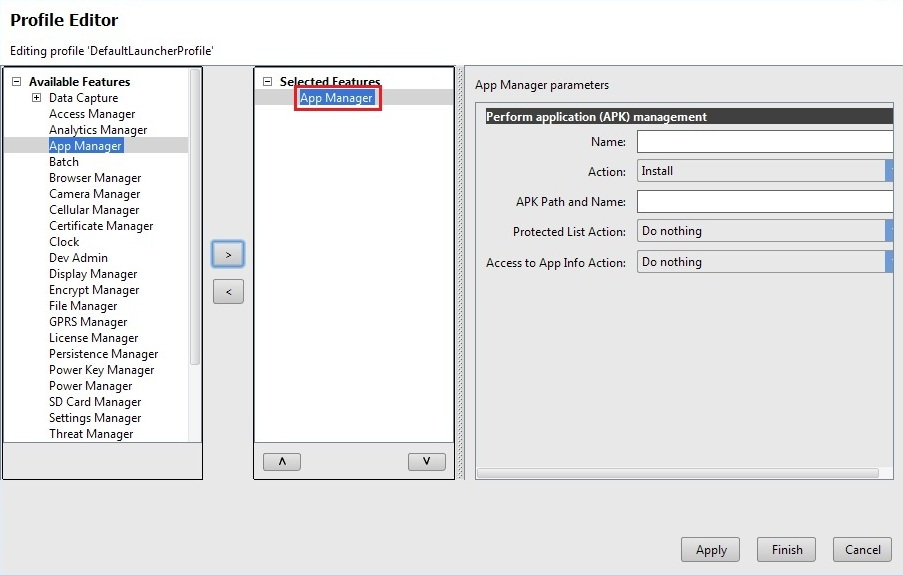

5. Now Click on the drop-down of the action field to see the supported features by App Manager. Select "Set as Default Launcher" feature.

    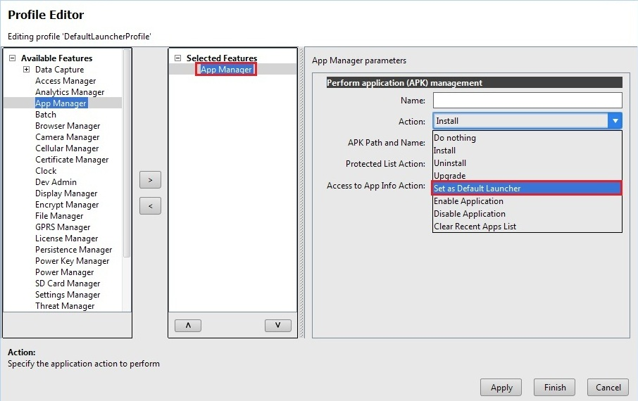

    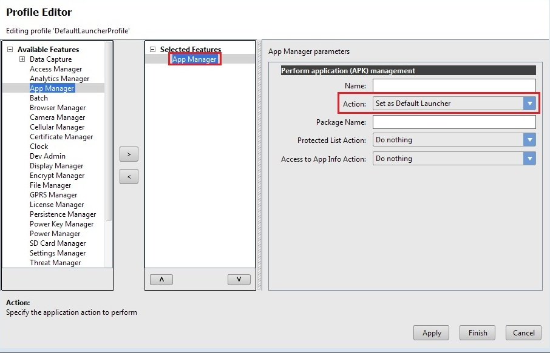
  
6. Keep the 'Name' field empty. Now let us set earlier installed EHS launcher application as default launcher application. So provide the previously found package name of EHS application  (com.motorolasolutions.enterprisehomescreen) in the field "Package Name". Keep the last to "Action" fields as it is.

	> Note: If you have a different launcher application then provide the package name accordingly.
  
    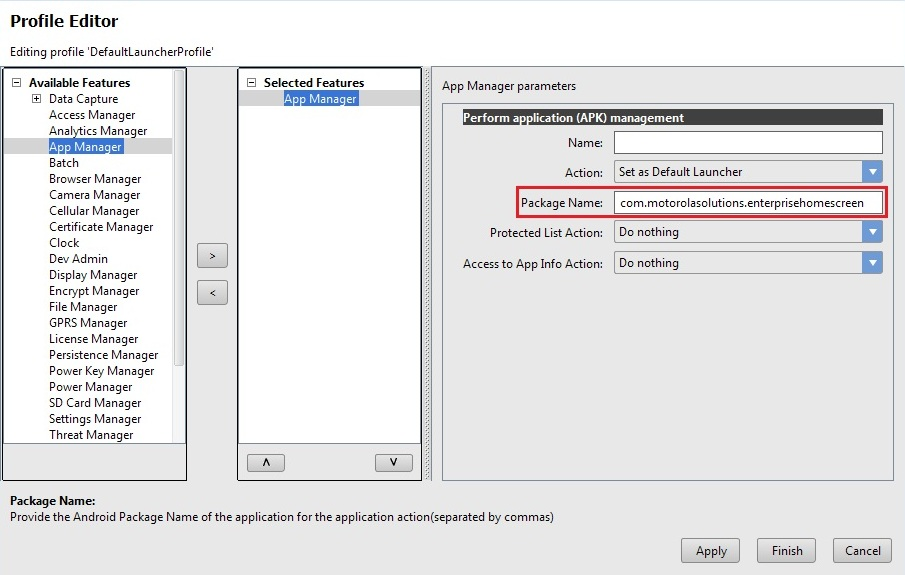
  
7. Click Apply and Finish. 

    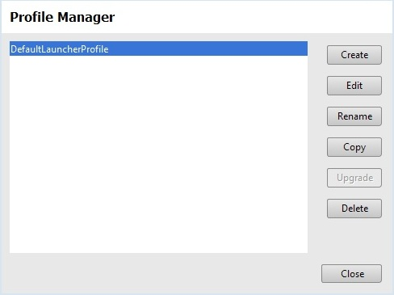
  
8. Click "Close".   
    >Note:  
    >Now the "EMDKConfig.xml" is created under "\assets" folder. This file will contain a definition of all of your profiles that you create. 
  
9. You can inspect the "EMDKConfig.xml" to see it is reflecting the changes made to the parameters via EMDK Profile Manager GUI earlier.  However, it is advised that this file not be manually updated and only be controlled via the Profile Manager. So you can see the entry of the 'Set Default Launcher' feature of App Manager and the package name of the launcher application that we entered earlier in the profile creation.

    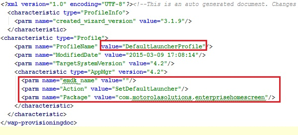    

## Enabling Android Permissions
1. Modify the Application's Manifest.xml to use the EMDK library and to set permission for the EMDK.
  
    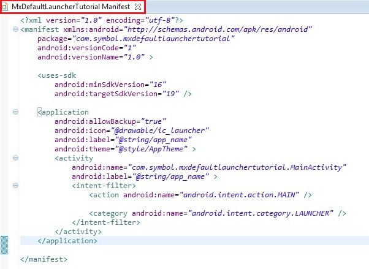

    You must first enable permissions for 'com.symbol.emdk.permission.EMDK':  
   
        :::xml
        <uses-permission android:name="com.symbol.emdk.permission.EMDK"/> 

    Then you must enable the library:  
      
        :::xml
        <uses-library android:name="com.symbol.emdk"/>

    When done, your manifest.xml should look like:

    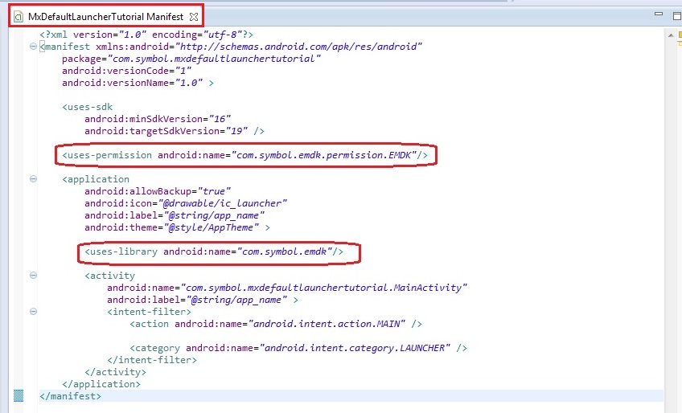 

##Adding Some Code    
1. Now we will start to add some code. 

    First you must add references to the libraries:  
    
        :::java
        import com.symbol.emdk.*;  
        import com.symbol.emdk.EMDKManager.EMDKListener;  
		import android.widget.Toast;    

    Then you must extend the activity to implement EMDKListener. Use Eclipse's Content Assist to implement the unimplemented functions of `onOpened` and `onClosed`.    
    
        :::java
        public class MainActivity extends Activity implements EMDKListener {  
          
            .. .. .. .. .. .. ...  
          
            @Override  
            public void onClosed() {  
                   // TODO Auto-generated method stub  
            }  
          
            @Override  
            public void onOpened(EMDKManager emdkManager) {  
                   // TODO Auto-generated method stub  
            }  
          
        }      

    We will now create some global variables to hold the profile name as well as instance objects of EMDKManager and ProfileManager with a status variable while applying the profile. Some of the variables are used to hold the name, type and description in case of any errors. These variables would be used throughout the code.

    >Note:
    >Verify the Profile name in the code with the one created in the Profile Manager. They both should be identical.    
    
        :::java
        //Assign the profile name used in EMDKConfig.xml  
        private String profileName = "DefaultLauncherProfile";  
          
        //Declare a variable to store ProfileManager object  
        private ProfileManager profileManager = null;  
          
        //Declare a variable to store EMDKManager object  
        private EMDKManager emdkManager = null;

		// Contains the parm-error name (sub-feature that has error)
		private String errorName = "";
	
		// Contains the characteristic-error type (Root feature that has error)
		private String errorType = "";
	
		// contains the error description for parm or characteristic error.
		private String errorDescription = "";
	
		// contains status of the profile operation
		private String status = "";     

    In the onCreate method, we call getEMDKManager so that the EMDK can be initialized and checked to see if it is ready. 

        :::java
        //The EMDKManager object will be created and returned in the callback.  
        EMDKResults results = EMDKManager.getEMDKManager(getApplicationContext(), this);  
          
        //Check the return status of getEMDKManager  
		if (results.statusCode == EMDKResults.STATUS_CODE.SUCCESS) {

			// EMDKManager object creation success

		} else {

			// EMDKManager object creation failed

		}

    So far your code should look like:
     
      

2. Now we need to use the `onOpened` method to get a reference to the EMDKManager. The EMDKListener interface will trigger this event when the EMDK is ready to be used. This must be implemented in order to get a reference to the EMDKManager APIs. This event will pass the EMDKManager instance and we assign it to the global variable `emdkManager` that we created in the previous steps. We then use that instance object to get an instance of ProfileManager and assign it to the global variable `profileManager`. This is how we will interface with the APIs in the rest of the code:

    >Note:
    >Set the name of the method argument to `emdkManager`  

        :::java
        this.emdkManager = emdkManager;

		// Get the ProfileManager object to process the profiles
		profileManager = (ProfileManager) emdkManager
				.getInstance(EMDKManager.FEATURE_TYPE.PROFILE);         
    
    Now that we have a reference to ProfleManager, we use it to install and activate the profile we built earlier using the `processProfile` method. We could have also performed this action at a different time, say when someone pressed a button, but we chose to do it as soon as the EMDK was ready:  

        :::java
        if (profileManager != null) {
			String[] modifyData = new String[1];

			// Call processPrfoile with profile name and SET flag to create the
			// profile. The modifyData can be null.
			EMDKResults results = profileManager.processProfile(profileName,
					ProfileManager.PROFILE_FLAG.SET, modifyData);

		    if (results.statusCode == EMDKResults.STATUS_CODE.CHECK_XML) {

			} else {
				// Show dialog of Failure
				AlertDialog.Builder builder = new AlertDialog.Builder(this);
				builder.setTitle("Failure");
				builder.setMessage("Failed to set Default Launcher...")
						.setPositiveButton("OK",
								new DialogInterface.OnClickListener() {
									public void onClick						    (DialogInterface dialog,
											int id) {

									}
								});
				AlertDialog alert = builder.create();
				alert.show();
			}
		}

	This `processProfile` method returns the result of applying a particular profile that we set using EMDK Profile Wizard in [EMDKResults](../../api/core/EMDKResults) reference. If the profile is successfully processed, it retuns the status as `CHECK_XML` and then we go on and parse the response to get further details whether the profile was applied successfully or not. Otherwise we display a Failure message in a [dialog](http://developer.android.com/reference/android/app/AlertDialog.html).

	> Note: 1. There is a difference between processing a profile successfully and applying a profile successfully.

	> Note: 2. If the status is other than `CHECK_XML`, we are simply displaying a failure message. You can actually go ahead and check different types of status and display the appropriate message accordingly, which is not in the scope of this sample tutorial.

	In case of `CHECK_XML` status, We retrieve  XML response string from the result using `getStatusString` method. So we will call a method `handleEMDKResult` to handle this [EMDKResults](../../api/core/EMDKResults), which we will create in the next step.

		:::java
		// Method call to handle EMDKResult
		handleEMDKResult(results);  

    Your onOpened method should now look like this:
    
    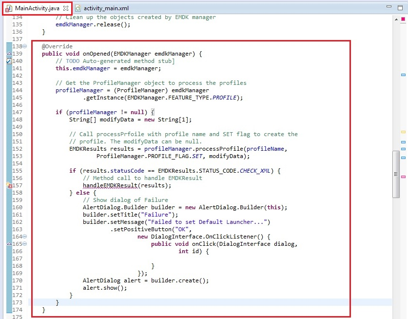

3. It shows error as we have not yet declared `handleEMDKResult` method. So let us create this method, which would get the XML String response from [EMDKResults](../../api/core/EMDKResults), call the `parseXML` method to parse it and eventually call `displayResults` method to display output in a [dialog](http://developer.android.com/reference/android/app/AlertDialog.html), which we would be declaring in coming steps. 

		:::java
		// Method to handle EMDKResult by extracting response and parsing it
		public void handleEMDKResult(EMDKResults results) {
			// Get XML response as a String
			String statusXMLResponse = results.getStatusString();
	
			try {
				// Create instance of XML Pull Parser to parse the response
				XmlPullParser parser = Xml.newPullParser();
				// Provide the string response to the String Reader that reads
				// for the parser
				parser.setInput(new StringReader(statusXMLResponse));
				// Call method to parse the response
				parseXML(parser);
			} catch (XmlPullParserException e) {
				e.printStackTrace();
			}
	
			// Method call to display results in a dialog
			displayResults();
		}

	Your `handleEMDKResult` method should now look like this:
    
    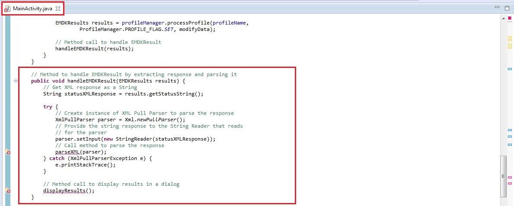

4. You will see few errors as we have not declared the respective methods to parse the response and display result. Lets do it one by one. In this step, we will create a method `parseXML` that uses [XML Pull Parser](http://developer.android.com/reference/org/xmlpull/v1/XmlPullParser.html) to parse the XML string response and set the status and error parameters if any.

	In the reponse, we are supposed to capture `name` and `desc` for `parm-error` tag, `type` and `desc` for `characteristic-error` tag in case of any errors.

		:::java
		// Method to parse the XML response using XML Pull Parser
		public void parseXML(XmlPullParser myParser) {
		int event;
		try {
			event = myParser.getEventType();
			while (event != XmlPullParser.END_DOCUMENT) {
				String name = myParser.getName();
				switch (event) {
				case XmlPullParser.START_TAG:
					// Get Status, error name and description in case of
					// parm-error
					if (name.equals("parm-error")) {
						status = "Failure";
						errorName = myParser.getAttributeValue(null, "name");
						errorDescription = myParser.getAttributeValue(null,
								"desc");

						// Get Status, error type and description in case of
						// parm-error
					} else if (name.equals("characteristic-error")) {
						status = "Failure";
						errorType = myParser.getAttributeValue(null, "type");
						errorDescription = myParser.getAttributeValue(null,
								"desc");
					}
					break;
				case XmlPullParser.END_TAG:

					break;
				}
				event = myParser.next();

			  }
		    } catch (Exception e) {
			e.printStackTrace();
		    }
		}

    Your complete `parseXML` method should now look like:
    
    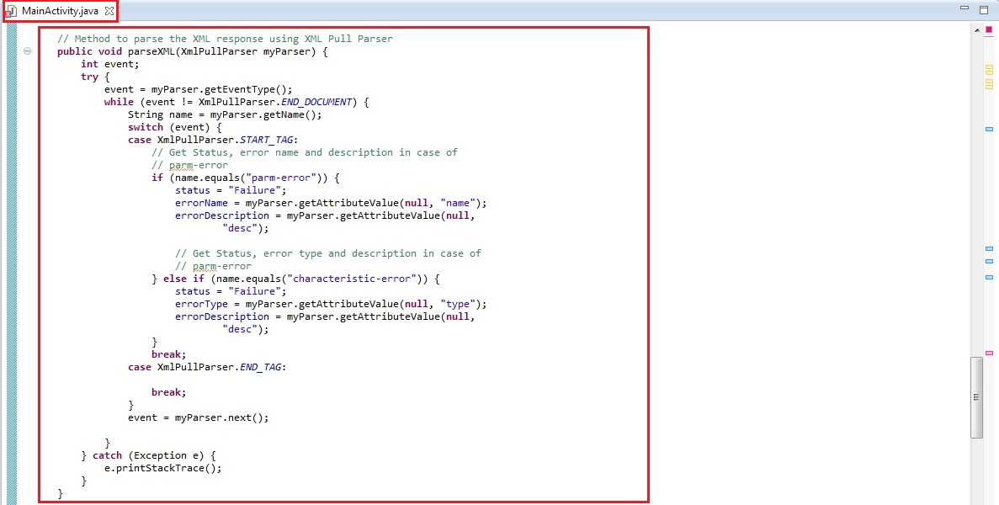 

5. You will still see one error as we need to declare `displayResults` method to display the result of profile operation in a [dialog](http://developer.android.com/reference/android/app/AlertDialog.html). Before displaying the results, we should form the content of the result to be shown first, specifically in case of errors. This could be done by creating `buildFailureMessage` method.
 
    In this method, the error message in case of error is formed using following way: 

    * Name and description of error if the response contains `parm-error`.
    * Type and description of error if the response contains `characteristic-error`.
    * Name, type and description of error if the response contains both `parm-error` and `characteristic-error`.

	The `buildFailureMessage` method would have following code to match the above mentioned criteria.  

		:::java
		// Method to build failure message that contains name, type and
		// description of respective error (parm, characteristic or both)
		public String buildFailureMessage() {
		  String failureMessage = "";
		  if (!TextUtils.isEmpty(errorName) && !TextUtils.isEmpty(errorType))
			 failureMessage = errorName + " :" + "\n" + errorType + " :" + "\n"
					+ errorDescription;
		  else if (!TextUtils.isEmpty(errorName))
			 failureMessage = errorName + " :" + "\n" + errorDescription;
		  else
			 failureMessage = errorType + " :" + "\n" + errorDescription;
		  return failureMessage;

		}

    `buildFailureMessage` method should look like:
    
    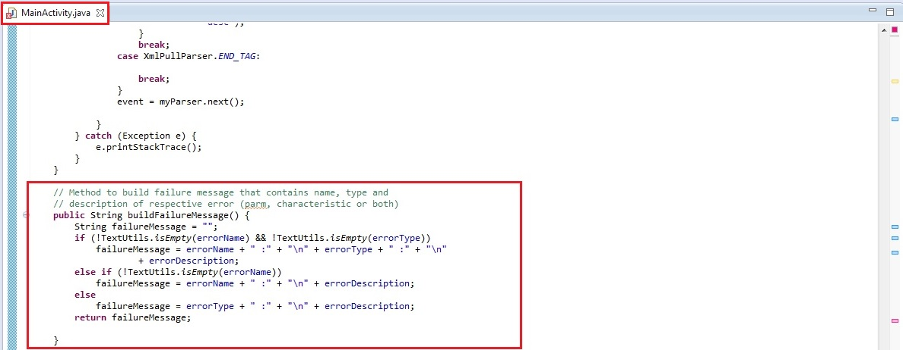

6. In this step, we will add `displayResults` method to display the result of profile operation. If the Profile is successfully applied, we will display a [Toast](http://developer.android.com/guide/topics/ui/notifiers/toasts.html) with a success message and in case of any errors, we will display a [dialog](http://developer.android.com/reference/android/app/AlertDialog.html) with the corresponding error details.

		:::java
		// Method to display results (Status, Error Name, Error Type, Error
		// Description) in a
		// dialog
		public void displayResults() {
		  if (TextUtils.isEmpty(errorDescription)) {

			 Toast.makeText(MainActivity.this,
					"Default Launcher changed successfully...",
					Toast.LENGTH_SHORT).show();

		  } else {
			 // Alert Dialog to display the error details while Profile creation
			 // operation of MX features
			 AlertDialog.Builder alertDialogBuilder = new AlertDialog.Builder(
					MainActivity.this);
			 // set title
			 alertDialogBuilder.setTitle(status);
			 // call buildFailureMessage() method to set failure message in
			 // dialog
			 alertDialogBuilder.setMessage(buildFailureMessage());
			 alertDialogBuilder.setCancelable(false).setPositiveButton("OK",
					new DialogInterface.OnClickListener() {
						public void onClick(DialogInterface dialog, int id) {
						}
					});
			 // create alert dialog
			 AlertDialog alertDialog = alertDialogBuilder.create();

			 // show it
			 alertDialog.show();
		  }
	    }

    The method `displayResults` should look like:
    
    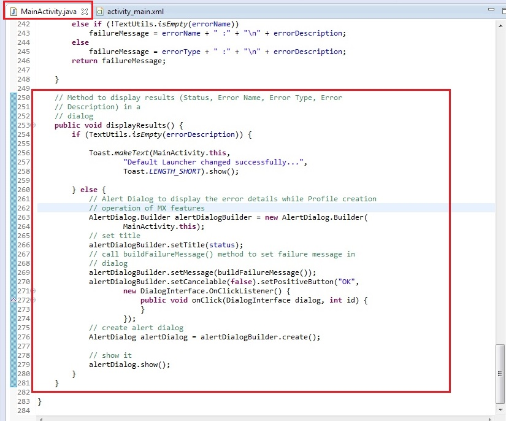

	You can see that all the errors are gone.  
    
7. Now let's override the "onDestroy" method so we can release the EMDKManager resources:  

        :::java
        @Override  
        protected void onDestroy() {  
            // TODO Auto-generated method stub  
            super.onDestroy();  
            //Clean up the objects created by EMDK manager  
            emdkManager.release();  
        } 

    Your onDestroy method should now look like this:  

    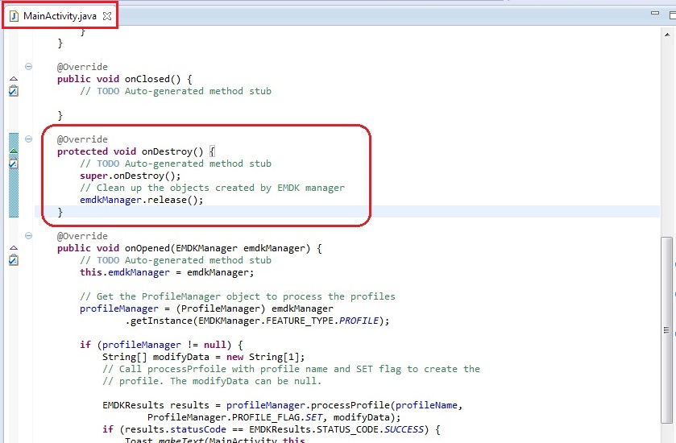 

    Settings at this point would allow you to apply EHS (Enterprise Home Screen) as the default launcher of your Mototrola Android device when we run the application.

    But we also want to set the another launcher application (Galaxy Launcher) as the default launcher programmatically. So we will add the required code to implement it.

8. Remove the default "TextView", inside "res/layout/activity_main.xml".

9. Add the following code that has an Edittext to enter the package name of the launcher application and a button to implement operation.

        :::xml
        <TextView
        android:id="@+id/label"
        android:layout_width="wrap_content"
        android:layout_height="wrap_content"
        android:layout_centerInParent="true"
        android:text="Enter Package Name:"
        android:textSize="18sp"
        android:textStyle="bold" />

        <EditText
        android:id="@+id/package_name"
        android:layout_width="match_parent"
        android:layout_height="wrap_content"
        android:layout_below="@+id/label" android:hint="Package Name"
        android:layout_margin="20dip" />

        <Button
        android:id="@+id/btn_set_default_launcher"
        android:layout_width="wrap_content"
        android:layout_height="wrap_content"
        android:layout_below="@+id/package_name"
        android:layout_centerHorizontal="true"
        android:layout_margin="5dip"
        android:text="Set Default Launcher" />

    The layout file 'activity_main.xml' inside "res/layout/" should now look like:

    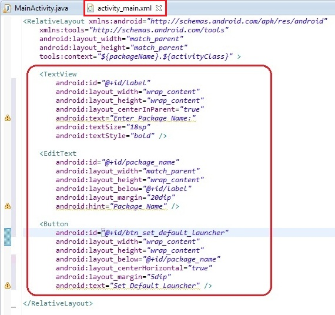

10. Now, In the Main activity make an entry of these UI elements using following code:

        :::java
		// Edit Text ro enter the package name of the launcher application
	    private EditText packageNameEditText;
	
	    // Button to set the application as default launcher
	    private Button setDefaultLauncherButton;

    So far the code looks like:

	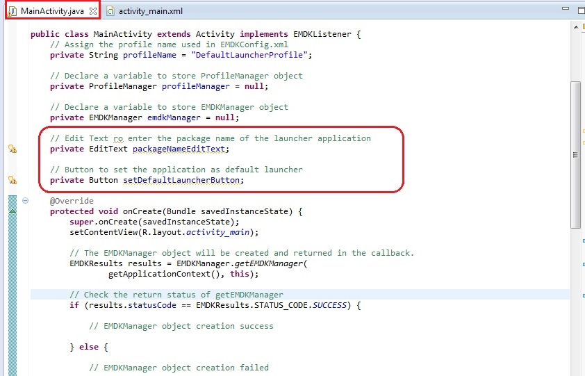 

11. Get the reference of these UI elements in `onCreate` method.

        :::java
        packageNameEditText = (EditText) findViewById(R.id.package_name);		
		setDefaultLauncherButton = (Button) findViewById(R.id.btn_set_default_launcher);
 
     The `onCreate` method now looks like:

    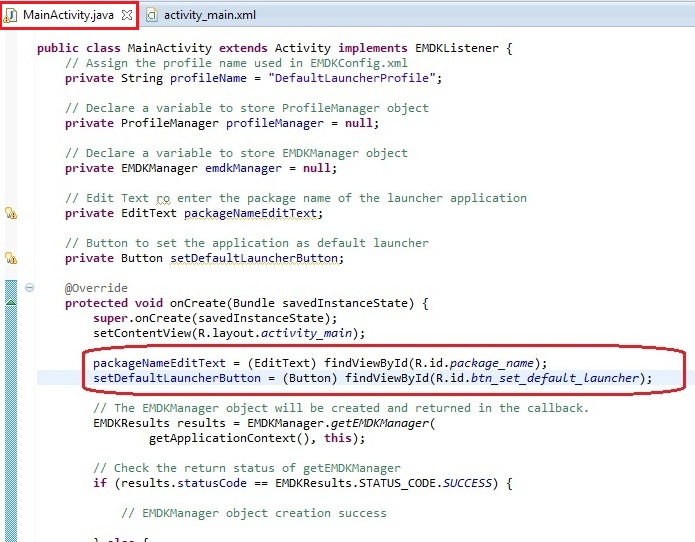

12. In this step, we will write a function that takes package name of the launcher application as input parameter and programmatically sets that application as the default launcher application.

    This method prepares the xml input for the `processProfile` method by accepting the package name of the launcher application provided by the user. It then calls the `handleEMDKResult` method that we have already created to handle the [EMDKResults](../../api/core/EMDKResults) and display the output.

    The `processProfile` method then sets the changes to `Profile Manager` and returns the result to the `EMDKResults` as follows:

        :::xml
        // Method that takes package name of the launcher application and
	    // programmatically sets that application as the default launcher.
	    public void setLauncherApplication(String packageName) {

			// Prepare XML to modify the existing profile
			String[] modifyData = new String[1];

			modifyData[0] = "<?xml version=\"1.0\" encoding=\"utf-8\"?>"
					+ "<characteristic type=\"Profile\">"
					+ "<parm name=\"ProfileName\" value=\"DefaultLauncherProfile\"/>"
					+ "<characteristic type=\"AppMgr\">"
					+ "<parm name=\"Action\" value=\"SetDefaultLauncher\"/>"
					+ "<parm name=\"Package\" value=\"" + packageName + "\"/>"
					+ "</characteristic>" + "</characteristic>";

			// Call process profile to modify the profile of specified profile
			// name
			EMDKResults results = profileManager.processProfile(profileName,
					ProfileManager.PROFILE_FLAG.SET, modifyData);

			if (results.statusCode == EMDKResults.STATUS_CODE.CHECK_XML) {
			// Method call to handle EMDKResult
			handleEMDKResult(results);
		    } else {
			// Show dialog of Failure
			AlertDialog.Builder builder = new AlertDialog.Builder(this);
			builder.setTitle("Failure");
			builder.setMessage("Failed to set Default Launcher...")
					.setPositiveButton("OK",
							new DialogInterface.OnClickListener() {
								public void onClick(DialogInterface dialog,
										int id) {

								}
							});
			AlertDialog alert = builder.create();
			alert.show();
		  }
	    }

    The method `setLauncherApplication` method should look like: 

    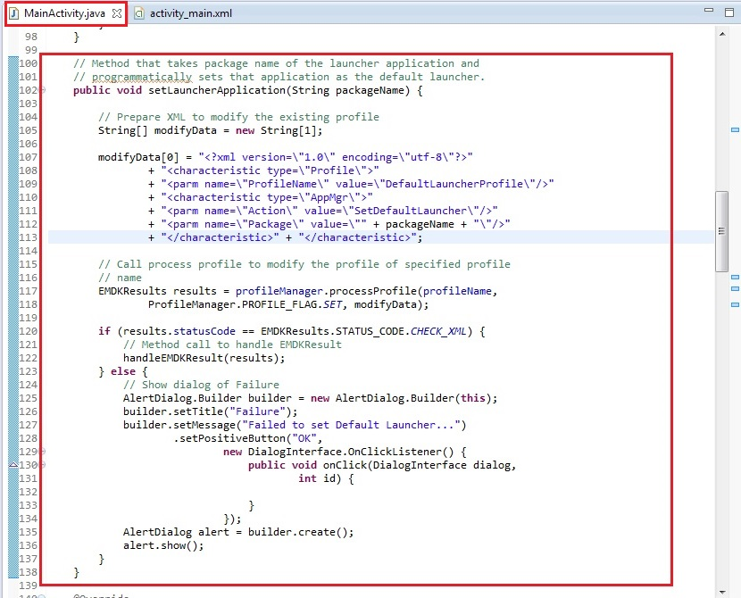 

13. Let us call this method by implementing on click listener of the `setDefaultLauncherButton` button. This listener will get the package name entered by user from the Edit Text and call the `setLauncherApplication` method for a valid package name as follows:

        :::java
        // On Click Listener for the button
		setDefaultLauncherButton.setOnClickListener(new OnClickListener() {

			@Override
			public void onClick(View v) {
				// TODO Auto-generated method stub

				// Get the package name entered by user from the Edit Text
				String packageName = packageNameEditText.getText().toString();

				if (TextUtils.isEmpty(packageName))
					// Invalid Package Name
					Toast.makeText(MainActivity.this,
							"Please enter a valid package name...",
							Toast.LENGTH_SHORT).show();
				else
					// Call the method to set launcher application as default
					// launcher
					setLauncherApplication(packageName);

			}
		}); 

    Finally the `onCreate` method should look like:

    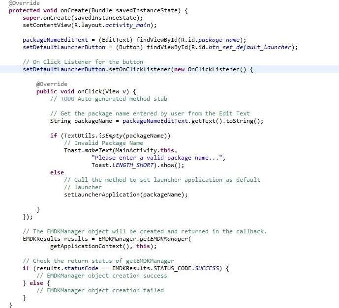

That's it!!! We are done with all the coding and configuration part. Now let us run the application.
 

## Running the Application

1. Connect the device (having the latest EMDK runtime) to USB port. 

    > Note:   
    > Make sure the device is in USB debug.
    
    The device currently has its own default launcher. Before Running the application, make sure that the two launcher applications (EHS and Galaxy Launcher) are already installed in the device.

    The default launcher of TC 55 device looks like:

    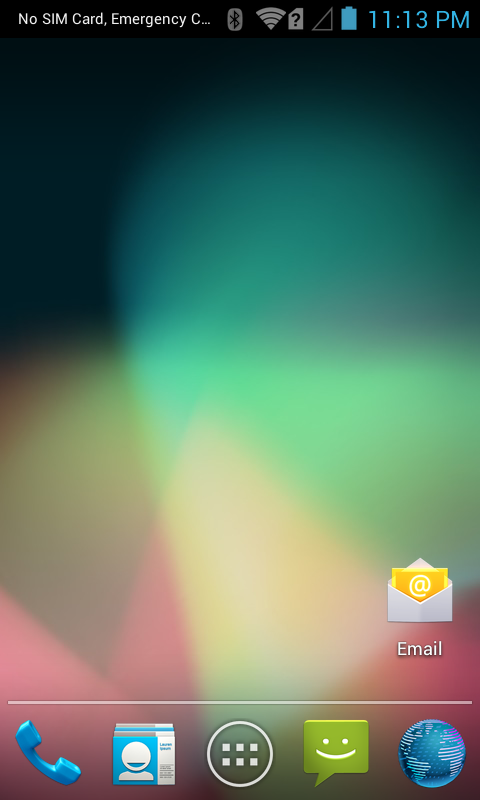

2. Run the application. The app sets the EHS (Enterprise Home Screen) application as the default launcher application as we had provided its package name while profile creation.

    The app automatically closes by displaying a success message as the launcher is changed. 
  
	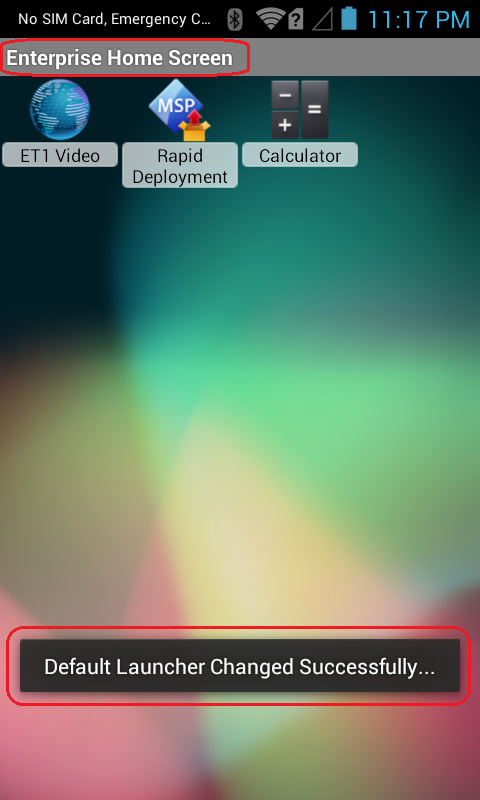
  
4. Now we will set Galaxy Launcher as the default launcher application. In order to do that, press and hold the menu key.

    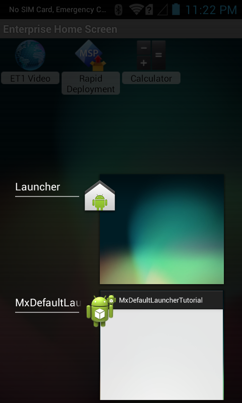

    Select the "MxDefaultLauncherTutorial" app and the app will open.
  
	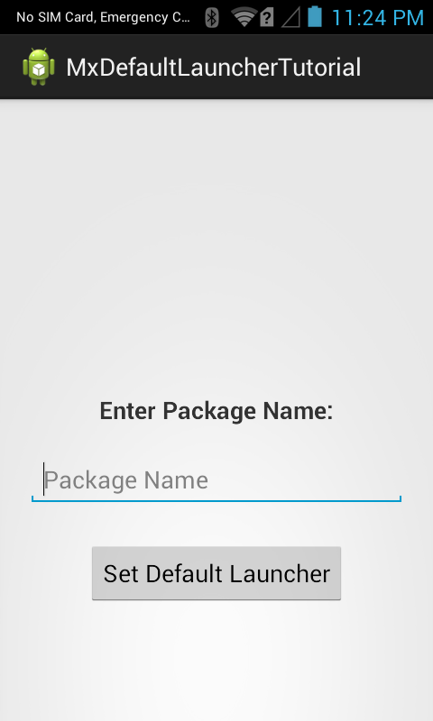

5. Enter the package name of Galaxy Launcher application that we had obtained previously **(com.epic.launcher.tw)**.
 
	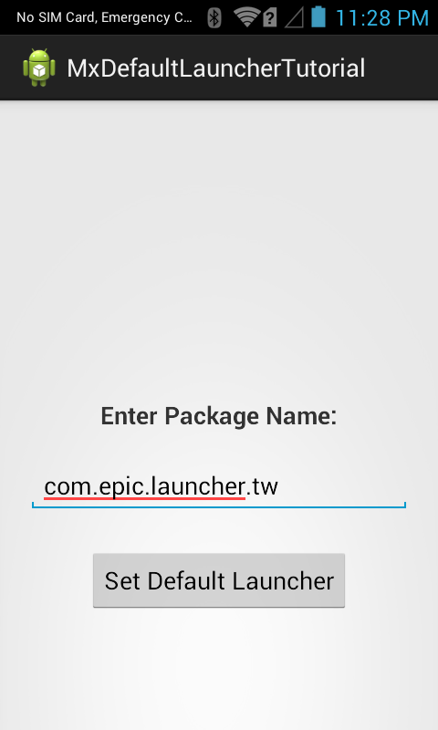

6. Click `Set Default Launcher` button. The app will now set Galaxy Launcher as the default launcher application. The app will close automatically displaying a success message.

    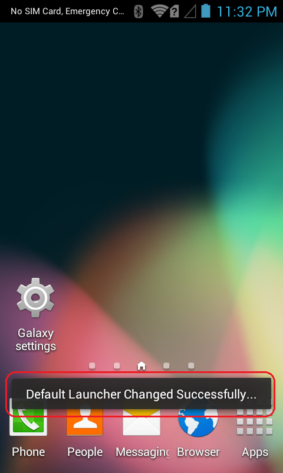

    > Note:
    > In case of failure, the app will display a failure message in an [Alert Dialog](http://developer.android.com/reference/android/app/AlertDialog.html) and no change will take place.  

##Important Programming Tips##

1. It is required to do the following changes in the application's AndroidManifest.xml:  
  
    >Note:
    >* Include the permission for EMDK:  
    
        :::xml
        <uses-permission android:name="com.symbol.emdk.permission.EMDK"/>
    
	>Note:
    >* Use the EMDK library:  
    
        :::xml
        <uses-library android:name="com.symbol.emdk"/>
  
2. Installing the EMDK for Android application without deploying the EMDK runtime on the Symbol device will fail because of missing shared library on the device. 
4. Use the DataWedge v1.7.12 or higher version to test the ProfileManager.processProfile() for DataWedge profiles.

## What's Next
Now that you have learned how to configure applications in the device using Mx App Manager feature, let us try some configuring some of the other Mx feature through profile creation. So in the next tutorial, we will concentrate on the "Power Manager" feature and try to explore this feature by creating a tutorial.

## Download the Source
The project source to this tutorial can be [downloaded (Internet Connection Required)](https://s3.amazonaws.com/emdk/Tutorials/EMDKMxDefaultLauncherTutorial.zip). You can also [download](https://s3.amazonaws.com/emdk/Tutorials/AllInstalledApps.apk) the Package Name helper application and install it - or modify the [source](https://s3.amazonaws.com/emdk/Tutorials/AllInstalledApps-Source.zip) to your liking.

