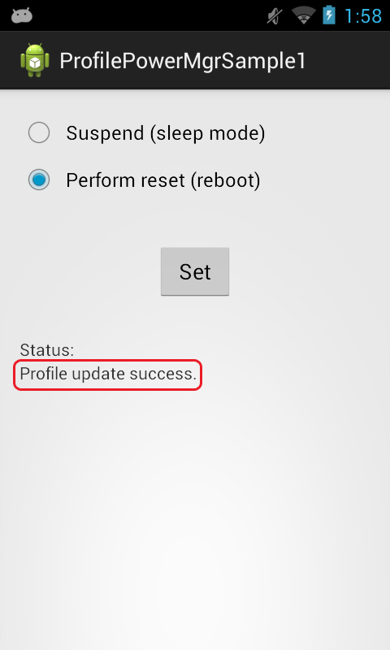

##Overview
The EMDK for Android allows you to control the power state of a Symbol device. 

The available actions are:  
- Do Nothing  
- Sleep Mode  
- Reboot  
- OS Update  

This sample application will allow you to set the power state of "Suspend" (sleep mode) or "Reset" (reboot).

##Prerequisites
- Java JDK 
- Eclipse with ADT plugin or  Android Studio
- EMDK for Android  
- An EMDK supported Android device

For more information about setting up the EMDK please see the [EMDK Overview](/emdk-for-android/4-0/guide/about).

##Loading the Sample Application
The following guide will walk you through setting up the EMDK samples in your IDE.

* [Android Studio](/emdk-for-android/4-0/guide/emdksamples_androidstudio)
* [Eclipse/ADT](/emdk-for-android/4-0/guide/emdksamples_eclipse)

##Using This Sample
1. When the application starts it should look like the following.  
    
2. Select the power mode you would like to set.  
      
3.  Click "Set" 
4.  Check the status field.   
    
  
