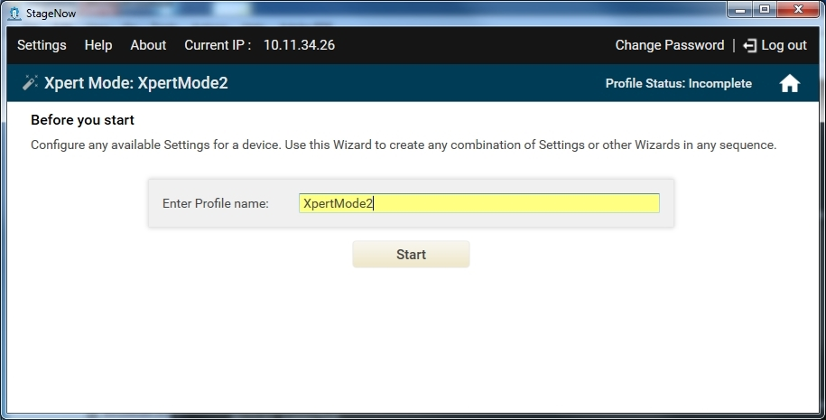
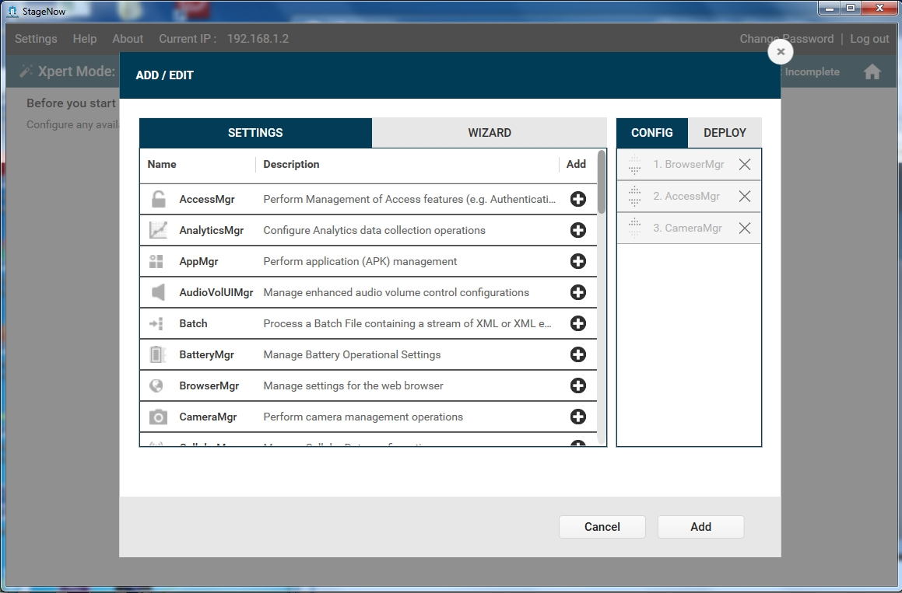
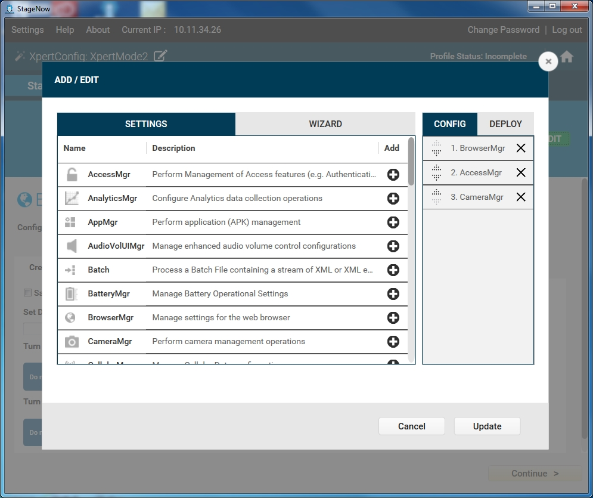
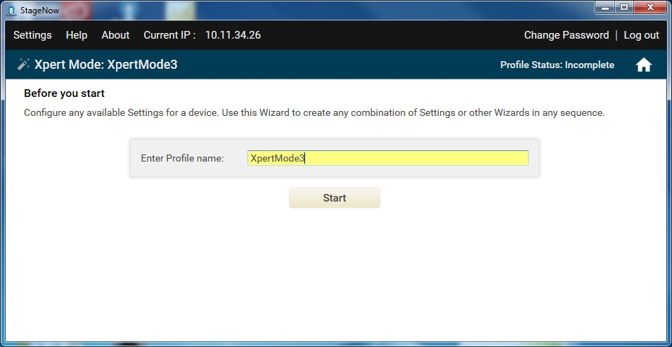
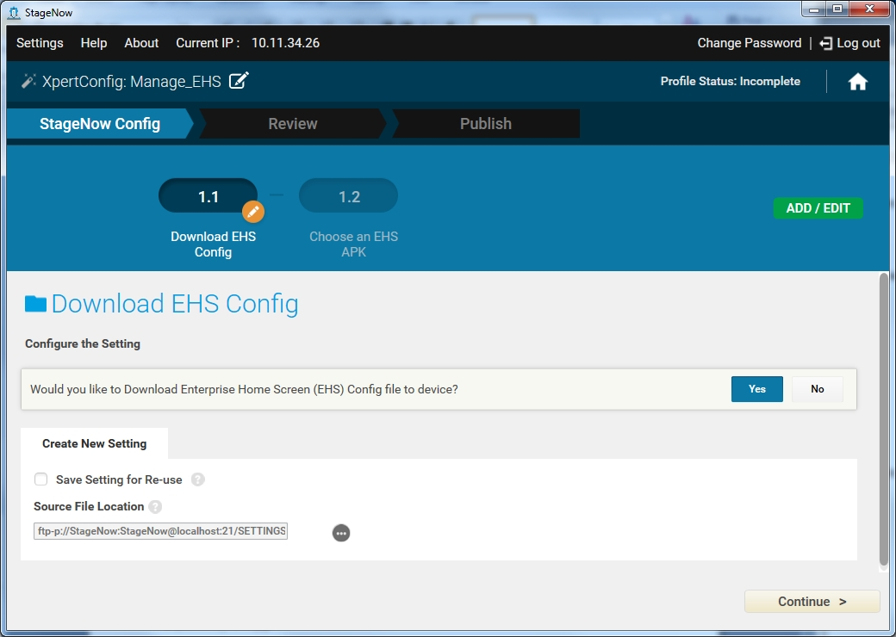
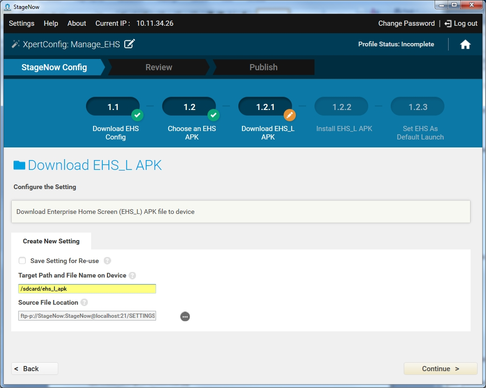

Xpert Mode allows enhanced control of the options and processes offered through the Profile Wizards and Setting Types in order to build custom profiles.

In this mode, the administrator can use any settings and/or any Wizards offered in the StageNow tool, in any order.  For example, an administrator can use the Configure a Device Wizard within the Expert Mode Wizard, but include additional settings as well as those offered in the standard Wizard. In this manner, administrators who are experts can take advantage of the flexibility offered by StageNow to use features not covered in the existing Wizards. Note that this does not apply in the RD section of the Xpert Wizard, which still restricts the administrator to selecting certain settings.

>Note:  
>All settings created within the configuration sections of the StageNow tool are stored in the staging bar code(s), audio file, or NFC tag, while settings created in the deployment section reside on the deployment server.

To create an Xpert Mode profile:

1. Select Create New Profile.

2. Select the MX version from the drop-down menu.

3. Select the Xpert Mode Wizard, and select Create.

    

4. Enter a name for the profile and select Start.

    

    Note: During profile creation, the top right of the window indicates the status of the profile, e.g., Incomplete.

5. On the ADD/EDIT window, select the SETTINGS tab to add settings to the Xpert Mode profile, and/or the WIZARD tab to add a Profile Wizard to the Xpert Mode profile.

6. Select the CONFIG or DEPLOY tab to select the portions of the Profile Wizard to include in the Xpert Mode profile.

7. Select the plus icon next to each setting and/or Wizard to add to the Xpert Mode profile, in the desired order to execute. This moves each item to the right pane (CONFIG or DEPLOY).

   

8. Select Add to move through the Profile Wizard and create the new Xpert Mode profile as described in [Creating a Staging Profile](/stagenow/2-2/stagingprofiles?Creating%20a%20Staging%20Profile).

   
   

## Updating an Xpert Mode Profile

During profile creation, select the ADD / EDIT button at any time to return to the ADD / EDIT Settings and Wizards window and add, modify or delete settings or Wizards in the profile. Select Update when finished. 

>Note:  
>Opening an existing Xpert Mode profile created in StageNow 2.1 imports the profile into the updated StageNow 2.2 Xpert Mode user interface described previously.

## Manage Enterprise Home Screen (EHS)
Enterprise Home Screen defines which applications appear on enterprise devices so only certain features are available to users. The Enterprise Home Screen (EHS) Wizard is available within Xpert Mode. 

To create an EHS profile:

1. Select Create New Profile.

2. Select the MX version from the drop-down menu.

3. Select the Xpert Mode Wizard, and select Create.

    

4. Enter a name for the profile and select Start.

5. On the ADD/EDIT window, select the WIZARD tab.

    

6. Select the plus sign next to Manage Enterprise Home Screen.

7. Select Add.

8. On the Download EHS Config window, select Yes to download an EHS config file to the device to stage.

    

9. Select a source file location and select Continue.

    

10. Select the type of apk to install and select Continue.

    

11. Ener the target path and file name to download to the device, and then enter the source file location, and then select Continue.

12. Enter the APK path and name, and select Continue.

13. Select Continue to acknowledge using EHS as the default launch screen on the device.

14. See [Review](/stagenow/2-2/stagingprofiles?Review) to continue creating the EHS profile.

